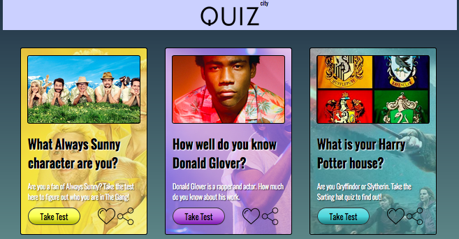

# _Sass Quiz Page_

#### _Third CSS solo project for Epicodus, 12.2.2016_

#### By _**Larry Dean Tunseth II**_

## Description

_This website is a custom made quiz site. This project shows my skills with Sass. It is my third solo CSS project for Epicodus_

## Setup/Installation Requirements

* _Clone this repository_
* _Open an HTTP server in the cloned directory_
* _Repo Link: https://github.com/larrytun/Sass_Quiz-Page_

## Known Bugs

_No Known bugs_

## Support and contact details

_If you run into problems contact Larry Tunseth at larrydeantun@gmail.com_

## Technologies Used

_Sass_
_HTML_
_CSS_
_GitHub_
_Git_

### License

*This software is licensed under the MIT license.*

Copyright (c) 2016 **_Larry Tunseth & Epicodus_**
